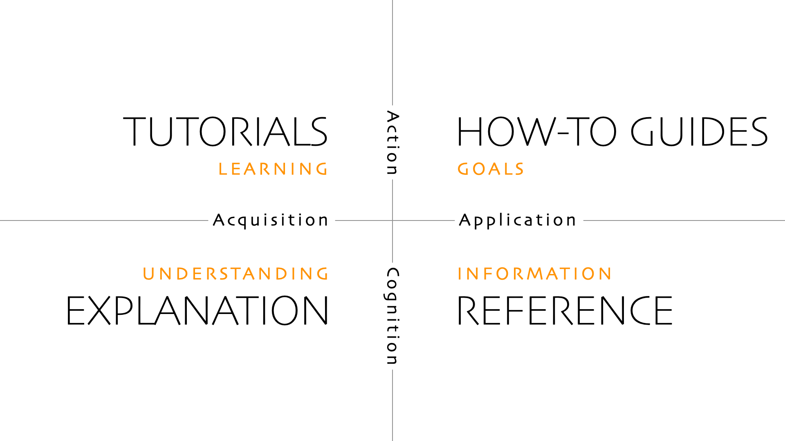

## Goal of documentation

The documentation of a package is the very first, and often only, thing that people will see about your package.

One of the goals of software documentation is to reduce as much as possible the effort required for people to be able to use your project. And for this reason, documentation is as important as the actual code in your package.

Ideally, you want your documentation to be separated into different categories:

- Tutorials: step-by-step introductions with a focus on learning
- How to guides: solve specific, focused problems
- Explanation: deeper context and reasoning about concepts
- Reference: complete, factual list of functions, classes, and arguments in your package

This is entirely based on the [Diátaxis framework](https://diataxis.fr/){target="_blank"}:

[](https://diataxis.fr/){target="_blank"}

We won't go into detail here about *what to write in the documentation* (that's the role of the [Diátaxis framework](https://diataxis.fr/){target="_blank"}), but rather *how to write the documentation*, *deploy it automatically*, and *ensure it's always up to date*.

But to give you some concrete and useful advice, here are a few key habits that will help you create better documentation:

- Always start with examples: people understand things much better when they are presented in context rather than in explanations.
- Try to have a narrative: what is your key point? What concept are you trying to explain? Can't we make it simpler?
- Don't focus too much on the "how" (the underlying workings of your package), but rather on the "why" (the concrete problem it solves).

## Building a website with `mkdocs material`

The very first thing is, your package **needs** a website. Nobody on earth will browse the source code of your project to understand how to use it. Fortunately for us, you need almost zero web development skills to create a documentation website, thanks to tools like [mkdocs](https://www.mkdocs.org/){target="_blank"} or [sphinx](https://www.sphinx-doc.org/en/master/){target="_blank"}.

Here we will use [mkdocs material](https://squidfunk.github.io/mkdocs-material/){target="_blank"}, which is a super charged version of [mkdocs](https://www.mkdocs.org/){target="_blank"}. It allows writing markdown and generating a super clean static[^1] website.

:::{.callout-note}
Please note that we **don't have to** use `mkdocs material` over another documentation framework. Other amazing options such as [sphinx](https://www.sphinx-doc.org/en/master/){target="_blank"}, [pdoc](https://pdoc.dev/){target="_blank"} or [quartodoc](https://github.com/machow/quartodoc){target="_blank"} (among others) exist.
:::

### Configuration of `mkdocs material`

- First, we install `mkdocs material` with:

```bash
uv add --dev mkdocs-material
```

::: {.callout-note}
The `--dev` flag tells uv to add this dependency to the "dev" dependencies (only required for package developers, not users). For more information on this topic, see the blog post [on handling dependencies](../create-a-package/handling-dependencies.html).
:::

* Then, we create a `mkdocs.yaml` file at the root of the project. The most basic content of it should be:

```yaml
site_name: Name of your package
```

* Finally, we create a `docs/` directory and a `docs/index.md` file. Write something in markdown in `docs/index.md` such as:

```md
## My package

This is the homepage of my **super cool** package.
```

## Preview our website

Before deploying our website (making it actually visible to other people over the internet), we want to preview it. This just means serving a local server that shows how it will look on other people's browsers. For this, we run:

```bash
uv run mkdocs preview
```

Then, it should display something like this:

```
INFO    -  Building documentation...
INFO    -  Cleaning site directory
INFO    -  Documentation built in 0.04 seconds
INFO    -  [14:24:40] Watching paths for changes: 'docs', 'mkdocs.yml'
INFO    -  [14:24:40] Serving on http://127.0.0.1:8000/
INFO    -  [14:24:42] Browser connected: http://127.0.0.1:8000/
```

Open the displayed url (here it is `http://127.0.0.1:8000/`) in your browser to preview the website.

## Multiple page website

Right now, our website has a single main page. Even though we almost never need hundreds of pages, it makes sense to have many pages, especially to follow the [Diátaxis framework](https://diataxis.fr/){target="_blank"} mentioned before.

For instance, let's configure our website to have 3 pages. We change our `mkdocs.yaml` file to this:

```yaml
site_name: Name of your package

nav:
  - index.md
  - examples.md
  - about.md
```

We also need to add 2 new files (with any kind of markdown content inside): `docs/examples.md` and `docs/about.md`.

`mkdocs-material` will automatically create a navigation bar that allows visitors to go to specific pages.

## Building reference documentation

For the moment, we saw how to make a website using plain markdown, but we have not really talked about how to document our code.

Documentation is here to describe what source code does. But the code will inevitably **change over time**, and you want to make sure that documentation, especially "reference" documentation, is always up to date with that.

Reference documentation is the documentation of all classes, functions, and arguments of your package. With `mkdocs-material` (and some plugins), we can **automatically** generate pages that will read our source code, collect all arguments, their types, and their docstrings (we will see what that is).

That means every time we change our source code (Python files), our **documentation website changes accordingly**. This is amazing because we do not have to worry about updating this part of the documentation.

### Docstrings

The previous is based on parsing **Python docstrings**. Docstrings are triple quote strings that are at the very top of a function definition, and are meant to describe **what a function does** and **what the arguments are supposed to do**. In practice, it looks like this:

```python
import re

def count_sunflowers(s: str) -> int:
   """
   Count the total occurrence of the "sunflower" word,
   including both singular and plural cases.

   Arguments:
      s: A string where you want to count occurrences.

   Returns:
      The total occurrence of the word(s) sunflower(s).

   Examples:

      ```python
      from my_package import count_sunflowers

      count_sunflowers("sunflower are beautiful") # outputs 1
      count_sunflowers("what a beautiful day")    # outputs 0
      count_sunflowers("sunflowers sunflower")    # outputs 2
      ```

   Notes:
      This is case insensitive.
   """
   s = re.sub(r"[^a-zA-Z\s]", "", s)
   s = s.lower()
   n_sunflower = s.split().count("sunflower")
   n_sunflowers = s.split().count("sunflowers")
   return n_sunflower + n_sunflowers
```

Docstrings usually start with an overview of what the function does, and then with a description of the argument(s) and what it returns. It is also relevant to add example usages right after.

### Adding reference documentation in `mkdocs-material`

In order to parse our source code, we need to install the `mkdocstrings-python` plugin with:

```bash
uv add --dev mkdocstrings-python
```

Then, we create a `docs/reference/` directory and our `mkdocs.yaml` becomes:

```yaml
site_name: Name of your package

nav:
  - index.md
  - example.md
  - about.md
  - Reference:
      - reference/count_sunflowers.md

plugins:
  - mkdocstrings
```

Inside `docs/reference/count_sunflowers.md`, we put:

```md
## Count sunflowers

::: package_name.count_sunflowers
```

Then, when previewing our website, we can see that there is a reference section with the content of our previous docstring, super well formatted.

We do not have to rewrite the name of the arguments and so on thanks to this. The source code becomes the only source of truth in our package, which ensures consistency and reduces a lot of manual work.

:::{.callout-caution}
Reference documentation is a very important part of documentation, but it is not exhaustive. It is important that you also add tutorials, guides, and explanations, as suggested in the [Diátaxis framework](https://diataxis.fr/){target="_blank"}. You can place them in their own directories to allow users to easily navigate your website.
:::

## Advanced configuration

For a large projects, our `mkdocs-material` configuration file could look like this:

```yaml
site_name: Name of your package

nav:
  - index.md                                   # main page of your website
  - contributing.md                            # contributing guide
  - Tutorials:                                 # tutorials
      - tutorials/get_started.md
      - tutorials/more_complex_usage.md
  - Guides:                                    # guides blog post
      - guide/first_guide.md
      - guide/second_guide.md
  - Reference:                                 # reference documentation
      - reference/some_function.md
      - reference/another_function.md

plugins:
  - mkdocstrings
```

Our package would then have the following structure:

```
my_package/
├── my_package/
│   ├── __init__.py
│   ├── my_module.py
│   └── other_module.py
├── docs/
│   ├── index.md
│   ├── contributing.md
│   ├── reference/
│   ├── guides/
│   └── tutorials/
├── .git/
├── .venv/
├── mkdocs.yaml
├── .gitignore
├── README.md
├── LICENSE
└── pyproject.toml
```

This is of course just a very simple example and can be very different.

## Advanced customization

So far, we've written some simple Markdown code, but you can change many other things: set a different theme, use pretty user interface elements, add code snippets, and so on.

`mkdocs-material` has a ton of super cool customization options, that you can often configure with just one line in your `mkdocs.yaml` file. It is recommended to browse the [official website](https://squidfunk.github.io/mkdocs-material/){target="_blank"} for this purpose.

If you are interested in a pre made configuration template, check out the [Python package template](../../python-package-template.html).

## How to deploy the website

The easiest (and recommended way) of deploying your website is to use [Github Actions](../workflow/github-actions.html). This is not particularly hard, and everything you need to know about what you can do with it (not only deploy websites) is in a [dedicated blog post](../workflow/github-actions.html).

[^1]: A static website is a set of pages that always look the same to everyone (no server side code).