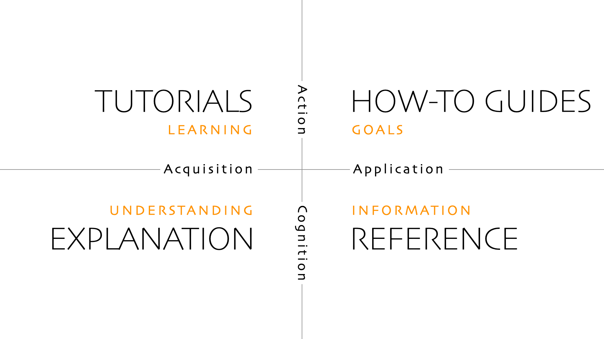

## Goal of documentation

The documentation of a package is the very first, and often only, thing that people will see about your package.

One of the goal of software documentation is to reduce as much as possible the efforts requires for people to be able to use your project. And for this reason, documentation is as much important as the actual code in your package.

Ideally, you want your documentation your documentation to be separated in different categories:

- Tutorials
- How-to guides
- Explanation
- Reference

This is entirely based on the [Diátaxis framework](https://diataxis.fr/):

[](https://diataxis.fr/)

> Here we will not go in-depth on the Dataxis framework, because the original website is already very complete. We will more focus on technical tools to build great documentation.

## Building a website with `mkdocs material`

The very first thing is, your packaged **needs** a website. Nobody on earth will browse the source code of your project to understand how to use it. Fortunately for us, you need almost zero web development skills to create a documentation website, thanks to tools like [mkdocs](https://www.mkdocs.org/) or [sphinx](https://www.sphinx-doc.org/en/master/).

Here we'll use [mkdocs material](https://squidfunk.github.io/mkdocs-material/), which is a super-charged version of [mkdocs](https://www.mkdocs.org/). It allows to write markdown and generate a super clean static[^1] website.

### Configuration of `mkdocs material`

- First, we install `mkdocs material` with:

```bash
uv add --dev mkdocs-material
```

::: {.callout-note}
The `--dev` flag tells uv to add this dependency to the "dev" dependencies (only required for package developers, not users). For more information on this topic, see the blog post [on handling dependencies](../create-a-package/handling-dependencies.html).
:::

- Then, we create a `mkdocs.yaml` file at the root of the project. The most basic content of it should be:

```yaml
site_name: Name of your package
```

- Finally, we create a `docs/` directory and a `docs/index.md` file. Write something in markdown in `docs/index.md` such as:

```md
## My package

This is the homepage of my **super cool** package.
```

## Preview our website

Before deploying our website (make it actually visible by other people over the internet), we want to preview it. This just means serving a local server that shows how it'll look on other people browsers. For this, we run:

```bash
uv run mkdocs preview
```

Then, it should displays something like this:

```
INFO    -  Building documentation...
INFO    -  Cleaning site directory
INFO    -  Documentation built in 0.04 seconds
INFO    -  [14:24:40] Watching paths for changes: 'docs', 'mkdocs.yml'
INFO    -  [14:24:40] Serving on http://127.0.0.1:8000/
INFO    -  [14:24:42] Browser connected: http://127.0.0.1:8000/
```

Open the displayed url (here it's `http://127.0.0.1:8000/`) in your browser to preview the website.

## Mutliple page website

Right now, our website has a single main page. Even though we almost never need hundreds of pages, it makes sense to have many pages, especially to follow the [Diátaxis framework](https://diataxis.fr/) mentionned before.

For instance, let's configure our website to have 3 pages. We change our `mkdocs.yaml` file to this:

```yaml
site_name: Name of your package

nav:
  - index.md
  - examples.md
  - about.md
```

We also need to add 2 new files (with any kind of markdown content inside): `docs/examples.md` and `docs/about.md`.

`mkdocs-material` will automatically create a navigation bar that allows visitors to go to specific pages.

## Building reference documentation

For the moment, we saw how to make a website using plain markdown, but we haven't really talked about how to document our code. 

Documentation is here to describe what source code does. But the code will inevitably **change over time**, and you want to make sure that documentation, especially "reference" documentation, is always up-to-date with that.

Reference documentation is the documentation of all classes, functions, arguments of your package. With `mkdocs-material` (and some plugins), we can **automatically** generate pages that will read our source code, collect all arguments, their types and their docstrings (we'll see what that is).

That means every time we change our source code (Python files), our **documentation website changes accordingly**. This is amazing because we don't have to worry about updating this part of the documentation.

### Docstrings

The previous is based on parsing **Python docstrings**. Docstrings are triple-quote strings that are at the very top of a function definition, and are meant to describe **what a function does** and **what the arguments are supposed to do**. In practice, it looks like this:

```python
import re

def count_sunflowers(s: str) -> int:
   """
   Count the total occurence of the "sunflower" word,
   including both singular and plural cases.

   Arguments:
      - s: A string where you want to count occurences.

   Returns:
      - The total occurence of the word(s) sunflower(s).

   Examples:

      ```python
      from my_package import count_sunflowers

      count_sunflowers("sunflower are beautiful") # outputs 1
      count_sunflowers("what a beautiful day") # outputs 0
      count_sunflowers("sunflowers sunflower") # outputs 2
      ```

   Notes:
      This is case insencitive.
   """
   s = re.sub(r"[^a-zA-Z\s]", "", s)
   s = s.lower()
   n_sunflower = s.split().count("sunflower")
   n_sunflowers = s.split().count("sunflowers")
   return n_sunflower + n_sunflowers
```

Docstrings usually start with an overview of what does the function, and then with a description of argument(s) and what it returns. It's also relevant to add example usages right after.

### Adding reference documentation in `mkdocs-material`

In order to parse our source code, we need to install the `mkdocstrings-python` plugin with:

```bash
uv add --dev mkdocstrings-python
```

Then, we create a `docs/reference/` directory and our `mkdocs.yaml` becomes:

```yaml
site_name: Name of your package

nav:
  - index.md
  - example.md
  - about.md
  - Reference:
      - reference/count_sunflowers.md

plugins:
  - mkdocstrings
```

Inside `reference/count_sunflowers.md`, we put:

```md
## Count sunflowers

::: package_name.count_sunflowers
```

Then, when previewing our website, we can see that there is a reference section with (for the moment) the content of our previous docstring, super well formatted.

We don't have to re-write the name of the arguments and so on thanks to this. The source code become the only source of truth in our package, which ensures consistency and reduces a lot manual work.

## Advanced customization

[^1]: A static website is a set of pages that always look the same to everyone (no server-side code).